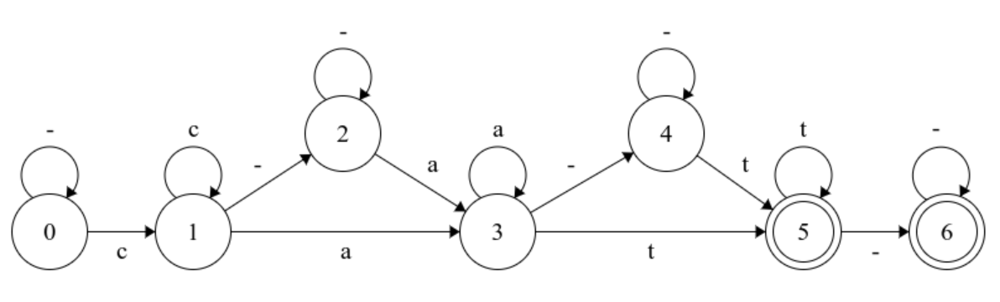

# ctc
 A from-scratch (NumPy only) implementation of the 2006 paper: Connectionist Temporal Classification: Labelling Unsegmented Sequence Data with Recurrent Neural Networks

### FSM
State machine based on the example sequence `"cat"` shown in the paper
